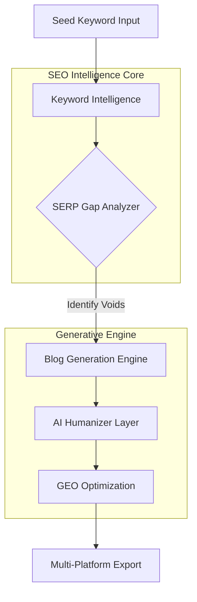

# Blogy.ai: The Ultimate AI SEO Content Engine 🚀


**Blogy.ai** is a production-ready, AI-driven content generation ecosystem designed for the modern SEO professional. It transforms simple keywords into ranking masterpieces by leveraging advanced NLP, real-time SERP gap analysis, and Generative Engine Optimization (GEO).

---

## 🔄 The Intelligence Pipeline

Understanding how Blogy transforms a simple keyword into an SEO powerhouse:



---

## ⚡ The "Killer" Features

### 🧠 1. Intelligence Workspace
Command your automated SEO engine from a single, high-fidelity dashboard. Synthesize content, analyze competitors, and monitor your ranking health in real-time.


### 🩺 2. Live SEO Coach & SERP Gap Analyzer
Don't just write; *optimize*. Our engine identifies what your competitors are missing—whether it's thin content structure, missing FAQ schemas, or lack of entity-based NLP depth—and injects it directly into your draft.


### 🕵️ 3. Competitor Intelligence ⚡
Enter any URL to extract the "SEO DNA" of your competitors. Discover their hidden strengths and critical vulnerabilities to outrank them effortlessly.


### 🤖 4. GEO (Generative Engine Optimization)
Future-proof your content for the age of AI search. Blogy automatically generates:
- **Snippet-Ready Answers**: Optimized for Google's Answer Engine.
- **Valid FAQ Schema**: Instant JSON-LD injection for rich results.
- **AI Humanization**: Reduces AI detection and adds authentic storytelling elements.

### 🌐 5. Multi-Platform Publishing
Adapt and export your content to **Medium**, **LinkedIn**, **Dev.to**, and **WordPress** with a single click.

---

## 🛠️ Tech Stack

- **Frontend**: Next.js 14, TailwindCSS, Framer Motion (Glassmorphism UI)
- **Backend**: FastAPI (Python), Uvicorn
- **AI Core**: GPT-4 context windows, Custom NLP Pipelines, BeautifulSoup4 (SERP Scraper)
- **Database**: MySQL (User Auth & Generation Archiving)

---

## 🚀 Quick Start

### 1. Backend Setup
```bash
cd backend
pip install -r requirements.txt
python -m uvicorn main:app --reload --port 8000
```

### 2. Frontend Setup
```bash
cd frontend
npm install
npm run dev
```

### 3. Database
Ensure a MySQL instance is running on port `3306`. The engine will auto-initialize the `blogy` database on first run.

---

## 🏆 Hackathon Vision
Blogy.ai isn't just a content generator; it's a **growth engine**. By bridging the gap between raw LLM output and high-ranking SEO assets, we empower brands to dominate search results in a world increasingly driven by AI-generated answers.

---

